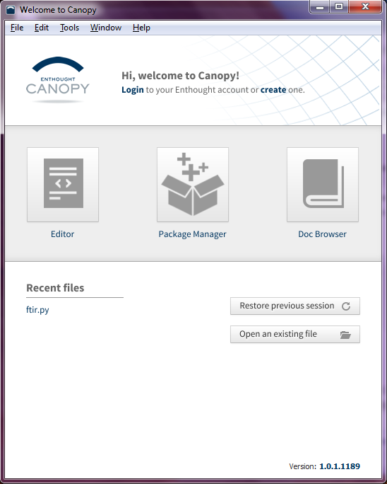
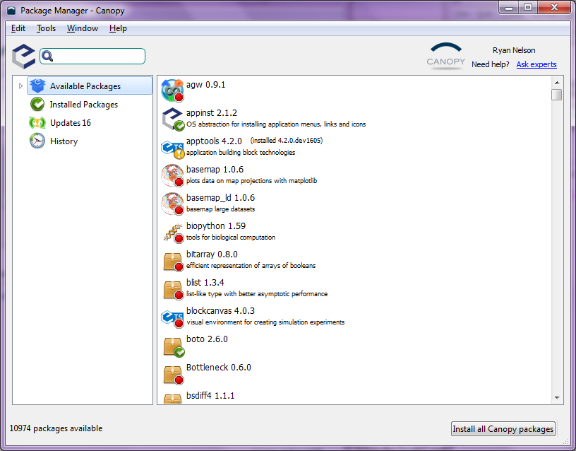

Appendix B
==========

Update Packages
---------------

After installing Canopy, the installer should ask you if you'd like to run the
Canopy program. You should say 'yes'. If not, then run Canopy right after
installation. The first time you run the program, a dialog pops up to tell you
that it is finishing the installation. When that is completed, you can click
okay, but make sure that the check box 'Make Canopy the Default Python' is
selected.

Make sure to login to the Canopy servers using the 'Login' button. This is
highlighted in the picture below.

Next, click the 'Package Manager' button, which should open a new window
(shown below). This utility provides a very convenient means of installing
third-party packages into your Python environment. You can also use it to keep
all of your installed packages updated with their most recent versions. On the
left, you'll see an 'Updates' button. Click that to see what packages need to
be updated. Then click the 'Install all Updates' button at the lower right.
(You should do this procedure fairly regularly to make sure things are at
their most recent state.) Be patient while this works it's magic. The packages
will slowly disappear as they are installed. If you get a bunch of 'Package
Manager Errors', you may not be logged into the Canopy server. Try logging out
and then back in to the server. If that doesn't work, close the program and
then reopen it.

Install Spyder
--------------

Spyder is an nice text editor with a built in (I)Python interpreter. Having a
dedicated environment like this can be very convenient for developing your own
code, so it can be nice to have this installed. There is already a code editor
built into Canopy. However, it is fairly new, and doesn't have some of the
features that I think are necessary for an introductory editor.

At the time of writing, Spyder is not compatible with the most recent version
of IPython in Canopy, so we need to install an older version as well. To do
this, open the Canopy 'Package Manager' and search for IPython. Click to
highlight the IPython package and then click the 'More Info' button. At the
bottom of the window, a small dialog will say 'There are *XXX* versions of
this package' with a button labeled 'Show'. Click this button. Click the most
recent IPython 0.13 package that is available in the repository, and then
click the install button that appears to the right.

Next, you'll need to install another, command-line-based package manager,
called 'pip'. To do this, open a terminal window, which will be 'cmd.exe' on
Windows or 'terminal.app' on MacOSX. At the terminal prompt, type
'easy_install pip'.  This will install another package manager called 'pip',
which is quite useful. If a dialog box pops up about installing something new,
be sure to click 'Okay'.

Now at the terminal prompt, type 'pip install spyder', which should install
Spyder. After that is done, type 'spyder' at the terminal prompt, and Spyder
should start up for the first time (may be a little slow the first time).

Setup Spyder
------------

When you first open Spyder, there will be a number of windows open. Many of
which will be unnecessary.

.. image:: spyder1.png
    :scale: 50%

In order to get Spyder into a good working state, you can try the following
:download:`initialization file<./spyder_ini_file>`. After downloading this
file to your computer, find your personal Spyder directory, which will be a
folder called '.spyder'. In Windows, this will be 'C:\\Users\\\ *user_name*'
(where *user_name* is your login name), and on Mac, it will be the the
directory where you start when you open a new terminal (type 'pwd' in a
terminal window). In this folder, there will be a file called '.spyder.ini'.
The period in the front of the file name will make it hidden on Macs, so you
may have to Monkey with some settings. Delete the '.spyder.ini' file in this
folder, and replace it with the one that you've just downloaded.  Be sure to
change the file name to '.spyder.ini' (with the period in the beginning). If
everything works, you should get a new Spyder window that looks something like
below.  If this file goofs up Spyder, close the program, delete your '.spyder'
folder, and restart Spyder. 

.. image:: spyder3.png
    :scale: 50%

'Double-Click'-able Python Files
--------------------------------

TBD.

