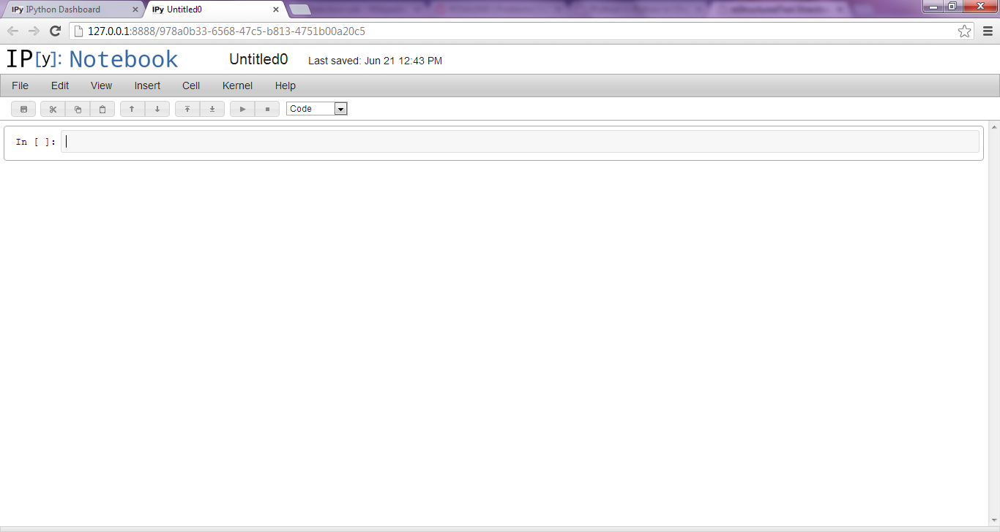

.. _ipy:

IPython
=======

The default Python shell is convenient but has limited functionality.
`IPython`_, an advanced interactive interpreter, was developed to address
these problems. IPython consists of many different interfaces: the simplest is
accessed from the terminal by typing ``ipython``. Although it appears very
similar to the regular Python shell, IPython has a number of special features,
such as command history memory, introspection tools, syntax coloring, and
built-in macros.  Over the past couple of years in particular, IPython has
become of very powerful tool, and it's use is always recommended over the
regular Python shell. In addition to terminal-based IPython, two much more
powerful IPython interfaces have recently been added -- the :ref:`qtconsole`
and :ref:`notebook` -- which will be described below.

IPython has many built-in 'magic' commands, which are essentially convenience
macros. Several of these commands are very important, because they make the
IPython shell behave in much the same way as a terminal window. These commands
are preceded by a ``%``, and the most important are going to be ``%cd``,
``%pwd``, and ``%run``. The first two do the same thing as described for the
terminal. The last one is special. The run magic allows you to run a Python
program file from inside the IPython session. All of the code that was in that
file will then be loaded into IPython just as if you had typed it in by hand.
This is a very useful way to build up a program file and inspect the data as
it is being generated. A full listing of other magic commands can be found on
the web or in the 'Magic' drop-down menu in the Qt Console.

.. _qtconsole:

Qt Console
----------

The Qt Console is an IPython shell inside of a nice GUI window, which gives
you some drop down menus and the ability to cut-and-paste (not possible from
terminal IPython in Windows). It can be accessed by typing ``ipython
qtconsole`` in the terminal. This is also the shell interface that you see
when using Spyder.  This IPython front end should always be preferred when you
need a Python shell.

.. _notebook:

Notebook
--------

The IPython notebook is a web-based interactive shell, which is started from
the terminal via ``ipython notebook``. This command should open your web
browser to the 'IPython Dashboard', which will look pretty empty at first. The
'New Notebook' button on the top right can be used to start an interactive
session. Each notebook acts as its own IPython session, and you can have as
many notebooks running as you'd like. 

.. figure:: notebook_dashboard.png
    :scale: 50%

    **Figure 1**: *The Notebook Dashboard that you first see when starting the
    IPython Notebook interface*

    **Figure 2**: *An empty IPython Notebook ready to run some code.*

Coding is a bit different in the notebook than the other Python shells. In
notebooks, one or more lines of code are input into cells.  To run a cell, you
either type 'Shift-Enter' or 'Ctrl-Enter', each of which does slightly
different things. Try them out for yourself to see the difference. The
advantage of the notebook interface is that you can still work interactively
with your data, but you can save the notebooks as well come back to them at a
later time. (Saving is accomplished using the disk icon at the upper left
corner or under File->Save...) In this way, the notebooks function quite a bit
like our Python IDEs, but you can save displayed intermediate data at any
point along the way.

For this tutorial, some of the examples will be downloadable as interactive
notebooks files. Each notebook is simply a specially-formatted text file, and
they can be saved into any folder you'd like.  In order to run a particular
notebook, you need to navigate to the folder using the terminal, and type
``ipython notebook`` from that location.  This will require that you know how
to navigate to different folders using the terminal (see above). If you can
double-click Python files to run them, then the :download:`following Python
program<run_notebook.py>` can be used to open the IPython notebook in whatever
folder it resides.

.. _IPython: http://ipython.org/ 

